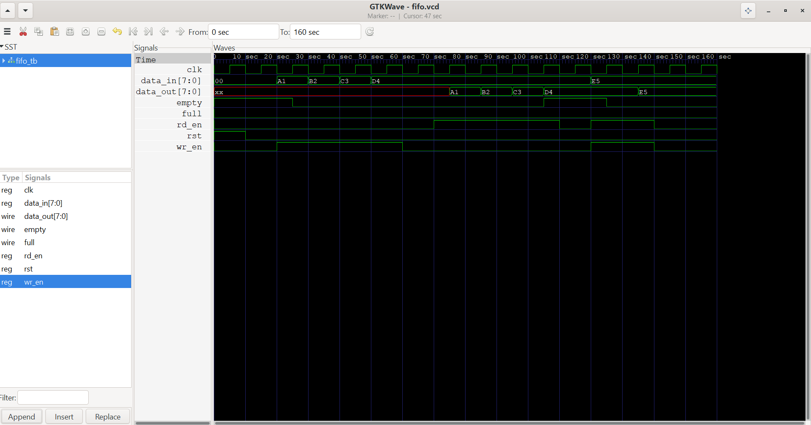
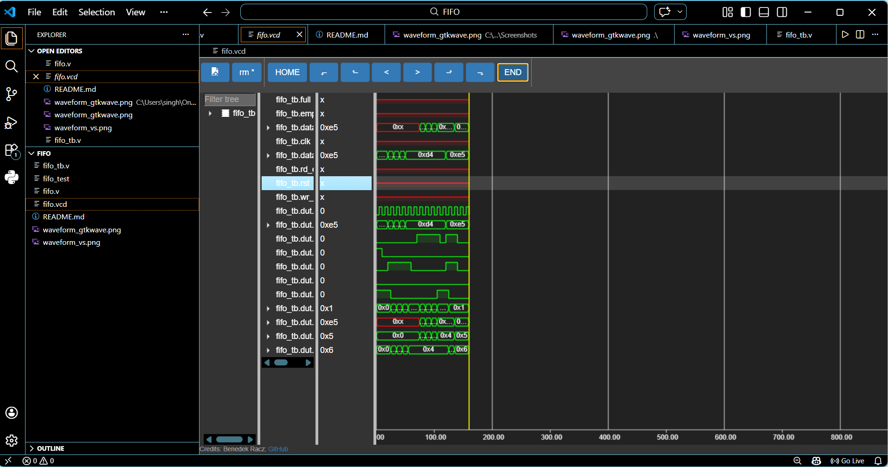

FIFO Design in Verilog

📌 Overview
I designed and implemented a Synchronous FIFO (First-In-First-Out) using Verilog to understand how data buffering works in digital systems.
FIFO ensures that the first data entered is the first one to come out, maintaining proper order.

⚙️ Features
- Parameterized design (DEPTH & WIDTH)
- Supports both read and write operations
- Handles simultaneous read and write
- Generates full and empty signals
- Simple and easy-to-understand implementation

🧠 Design Explanation

🔹 FIFO Working
- Data is written into FIFO when "wr_en = 1"
- Data is read from FIFO when "rd_en = 1"
- The order of data is always maintained (FIFO behavior)

🔹 Pointers
- "wr_ptr" → points to the next write location
- "rd_ptr" → points to the next read location

🔹 Count Logic
- Keeps track of how many elements are present in FIFO
- Used to generate:
  - "full" → when FIFO is completely filled
  - "empty" → when FIFO has no data

📥 Inputs
- "clk" → clock signal
- "rst" → reset
- "wr_en" → write enable
- "rd_en" → read enable
- "data_in" → input data

📤 Outputs
- "data_out" → output data
- "full" → FIFO full indicator
- "empty" → FIFO empty indicator

🧪 Simulation
🔹 Tools Used
- Icarus Verilog (iverilog)
- GTKWave

🔹 Steps to Run
iverilog -o fifo_tb fifo.v fifo_tb.v
vvp fifo_tb
gtkwave fifo.vcd

📊 Waveform Output

GTKWave

VS Code

👉 The waveforms show that:
- Data is read in the same order as it is written
- FIFO maintains correct sequence
- Read and write operations work correctly
- Simultaneous read/write is handled properly

🚀 Future Improvements
- Implement Asynchronous FIFO
- Improve full/empty logic using pointer comparison
- Add overflow and underflow detection
- Enhance testbench with random inputs

🎯 Conclusion
Through this project, I learned how FIFO works internally using pointers and control logic.
This helped me understand important concepts like data flow, memory handling, and synchronization in digital design.

👤 Author
Anubhav

[def]: Waveform_vs.png
